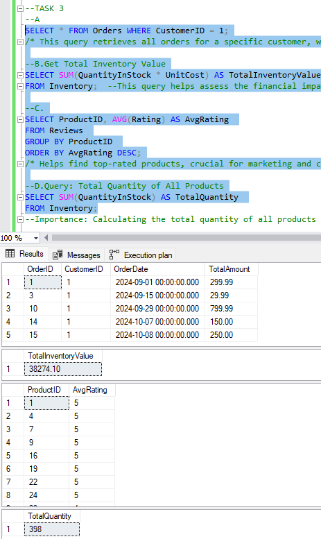
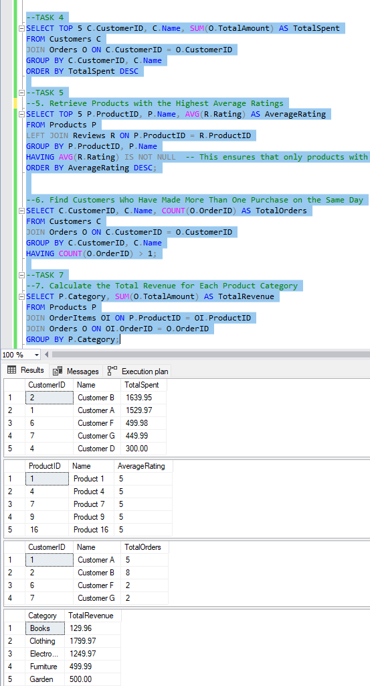
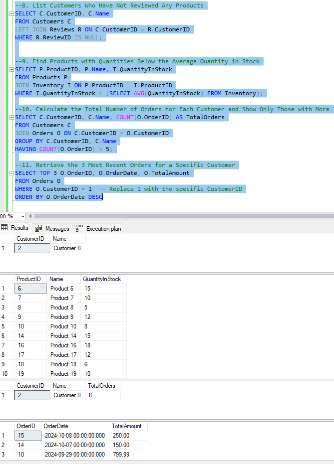
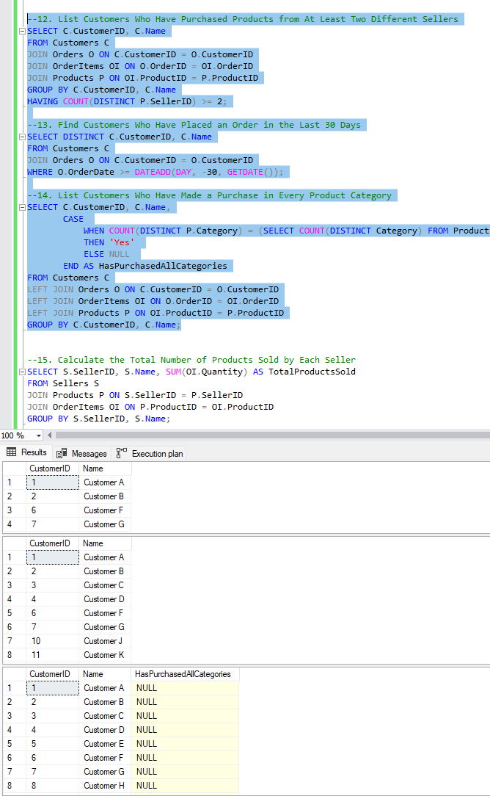
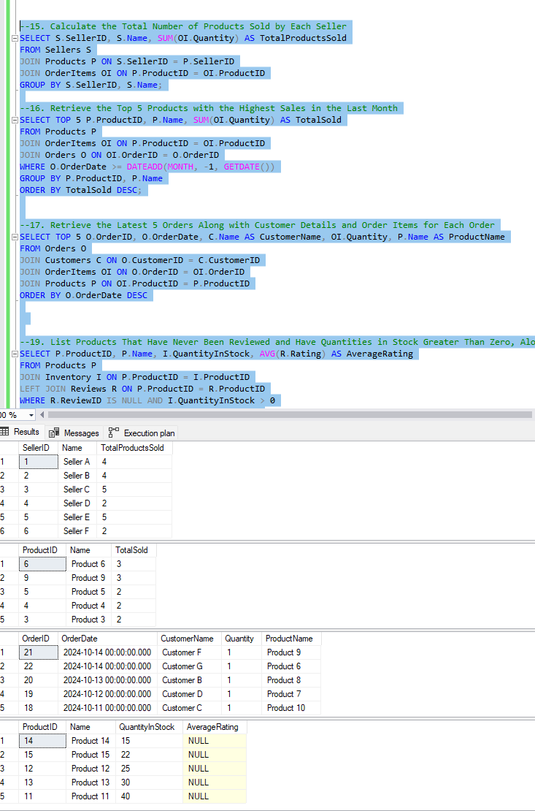
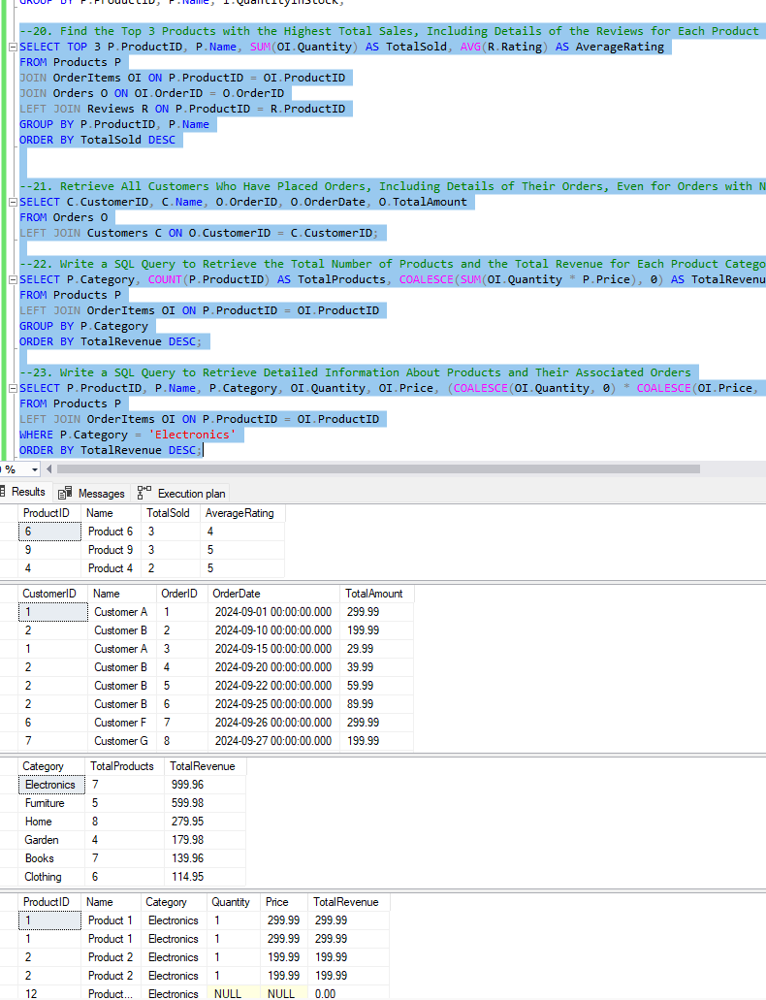
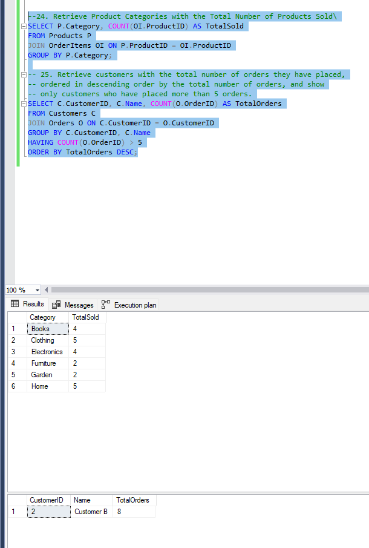

--Project Overview
--This project focuses on converting a dataset to a relational model, creating necessary SQL tables, and solving various queries related to customers, products, orders, reviews, and more. It covers a wide range of SQL concepts like aggregations, joins, and subqueries, providing insights into practical database management.

--1. Relational Model and Data Insertion
--The relational model was created to represent the business case, including tables for Customers, Products, Orders, OrderItems, and Reviews. Each table was populated with at least 20 rows of meaningful dummy data to simulate real-world scenarios.

--Key Challenges:
--Ensuring data consistency across tables.
--Inserting diverse and meaningful data to test each query accurately.
--Solution:
--Data integrity was maintained by enforcing primary and foreign key constraints.
--A variety of product categories and customer behaviors were simulated to ensure diversity in the data.

--2. SQL Queries:
--1. Top 5 Customers Who Spent the Most Money
--This query identifies customers who have spent the most money overall. It helps businesses recognize high-value customers for special promotions.

--2. Retrieve Products with the Highest Average Ratings
--Finding products with high average ratings helps identify customer favorites. This is crucial for businesses looking to promote best-selling products.

--3. Find Customers Who Made More Than One Purchase on the Same Day
--This query highlights repeat customers who place multiple orders in a day, indicating high engagement.

--4. Total Revenue for Each Product Category
--Understanding the revenue generated by different categories helps optimize inventory and marketing strategies.

--Query 5: List Customers Who Have Not Reviewed Any Products
--Importance: Helps identify customers who have purchased products but haven't provided feedback, offering an opportunity for follow-up or incentivization. Challenge: Identifying customers who have made purchases but haven't left any reviews. Solution: A LEFT JOIN was used between Customers and Reviews to find customers without reviews.

--Query 6: Find Products with Quantities Below the Average Quantity in Stock:
--The task involves finding products with stock quantities below the average, which is essential for effective inventory management. The challenge lies in calculating the average stock quantity and identifying the understocked products. A solution was implemented using a subquery to determine the average stock and retrieve the relevant products that fall below this threshold.

--Query 7: Calculate Total Orders for Each Customer with More Than 5 Orders
--Importance: Helps identify customers with frequent purchases, useful for customer loyalty programs. Challenge: Counting orders for each customer and filtering based on a threshold of more than 5 orders. Solution: Grouped orders by CustomerID and filtered those with more than 5 orders.

--Query 8: Retrieve the 3 Most Recent Orders for a Specific Customer
--Importance: Useful for customer support or follow-up on recent orders. Challenge: Fetching only the latest three orders for a given customer. Solution: Used ORDER BY and LIMIT to fetch the latest orders for a specific customer.

--Query 9: List Customers Who Have Purchased from at Least Two Sellers
--Importance: Identifies customers who have a diverse purchasing pattern. Challenge: Counting distinct sellers per customer and filtering those with purchases from at least two sellers. Solution: The query uses DISTINCT on SellerID and groups by CustomerID.

--Query 10: List Customers Who Made a Purchase in Every Product Category
--Importance: Identifies highly engaged customers who have purchased from all categories, indicating comprehensive usage of the platform. Challenge: Comparing distinct categories purchased by a customer with the total number of product categories. Solution: Used HAVING COUNT(DISTINCT Category) to ensure customers have made purchases in all categories.

--Query 11: Retrieve the Latest 5 Orders Along with Customer Details and Order Items for Each Order
--Importance: Helps in tracking recent activity and monitoring customer engagement for support or marketing purposes. Challenge: Fetching both order and item details for the most recent 5 orders, while ensuring all related data is retrieved. Solution: Used JOIN to combine order, customer, and order items details, sorted by order date in descending order, and limited the results to 5.

--Query 12: List Customers Who Have Purchased Products from at Least Two Different Sellers
--Importance: This query helps in identifying customers who explore products from various sellers, indicating a broader interest in the marketplace. Challenge: Ensuring that a customer has ordered from more than one seller. Solution: The query groups by CustomerID and counts distinct sellers using DISTINCT.

--Query 13: Find Customers Who Have Placed an Order in the Last 30 Days
--Importance: Identifying recent customers allows businesses to target them for feedback, marketing, or promotions. Challenge: Calculating the date range dynamically to find customers who placed orders within the past 30 days. Solution: Used the DATEDIFF function to compare the order date with the current date.

--Query 14: List Customers Who Have Made a Purchase in Every Product Category
--Importance: Identifying loyal or diverse customers who purchase from all product categories is valuable for customer segmentation. Challenge: Ensuring the customer has purchased from every distinct product category. Solution: The query counts distinct categories purchased by a customer and compares it to the total number of product categories.

--Query 15: Calculate the Total Number of Products Sold by Each Seller
--Importance: This query helps sellers evaluate their sales performance and assists businesses in determining which sellers are performing best. Challenge: Aggregating product quantities sold by each seller. Solution: A JOIN between Products and OrderItems is used to calculate total product quantities sold.

--Query 16: Retrieve the Top 5 Products with the Highest Sales in the Last Month
--Importance: Identifying top-performing products in recent months aids in marketing and inventory decisions. Challenge: Ensuring the date range is set to the last 30 days, and retrieving the top-selling products. Solution: Used SUM for product sales and limited the result to the top 5.

--Query 17: Retrieve the Latest 5 Orders Along with Customer Details and Order Items for Each Order
--Importance: This query helps businesses track the most recent orders and monitor customer behavior. Challenge: Retrieving complete details, including customers, order items, and products, for the latest orders. Solution: Joined Customers, Orders, and OrderItems tables and filtered the result for the 5 most recent orders.

--Query 18: Retrieve Customers Who Have Made Purchases in Every Product Category, Along with the Total Number of Categories They Have Purchased From
--Importance: Shows loyal customers who buy across all categories, useful for targeted marketing. Challenge: Combining both total categories purchased and ensuring the customer has purchased from all available categories. Solution: Used GROUP BY and HAVING to ensure customers bought from every category.

--Query 19: List Products That Have Never Been Reviewed and Have Quantities in Stock Greater than Zero, Along with the Average Rating for Their Category
--Importance: Helps identify unsold or under-reviewed products, indicating areas for improvement. Challenge: Finding products without reviews and including the category's average rating. Solution: Used LEFT JOIN to find products with no reviews and added the category rating.

--Query 20: Find the Top 3 Products with the Highest Total Sales, Including Details of the Reviews for Each Product
--Importance: Helps track top-selling products and assess customer feedback for improvements. Challenge: Combining sales data with reviews. Solution: Joined Products, OrderItems, and Reviews tables and used SUM to get total sales.

--Query 21: Retrieve All Customers Who Have Placed Orders, Including Details of Their Orders Even for Orders with No Associated Customers
--Importance: Ensures that all orders, even without detailed customer information, are accounted for, crucial for audit and data integrity. Challenge: Handling cases where orders might not have customer details. Solution: Used LEFT JOIN to include all orders and their related customer information.

--Query 22: Retrieve the Total Number of Products and the Total Revenue for Each Product Category, Including Unsold Products, Ordered by Revenue
--Importance: Provides insights into revenue by category, helping businesses allocate resources. Challenge: Including unsold products in the calculation and ordering by revenue. Solution: Used GROUP BY to aggregate total products and revenue, ordered by revenue.

--Query 23: Retrieve Detailed Information About Products and Their Associated Orders, Filtered for 'Electronics' Category with Order Quantities Between 5 and 10
--Importance: Provides detailed insight into product performance, filtered for specific criteria. Challenge: Filtering results for the electronics category and specific order quantities. Solution: Filtered on product category and quantity range, ordered by total revenue.

--Query 24: List Customers Who Have Purchased Products from All Product Categories but Have Never Reviewed Any Products
--Importance: Identifying customers who engage across all product categories but haven’t left feedback helps target them for reviews. Challenge: Ensuring the customer has purchased from all categories and filtering those without reviews. Solution: A combination of HAVING to count product categories and a LEFT JOIN to exclude customers with reviews.

--Query 25: Retrieve Products with an Average Rating Above 4.5 and That Have Been Purchased by at Least 10 Different Customers
--Importance: Highlights highly rated products with broad customer appeal. Challenge: Ensuring products meet both rating and customer diversity criteria. Solution: Used HAVING to filter products with high ratings and distinct customer purchases.

--Challenges and Solutions
--Across these queries, the primary challenges were:

--Ensuring data integrity while working with relational models.
--Efficiently handling large datasets for aggregate calculations.
--Filtering for specific conditions across multiple tables.
--To address these, careful indexing, optimized joins, and thoughtful use of subqueries were implemented.

   -- RESULTS:

   
   
   
   
   
   
   

   

